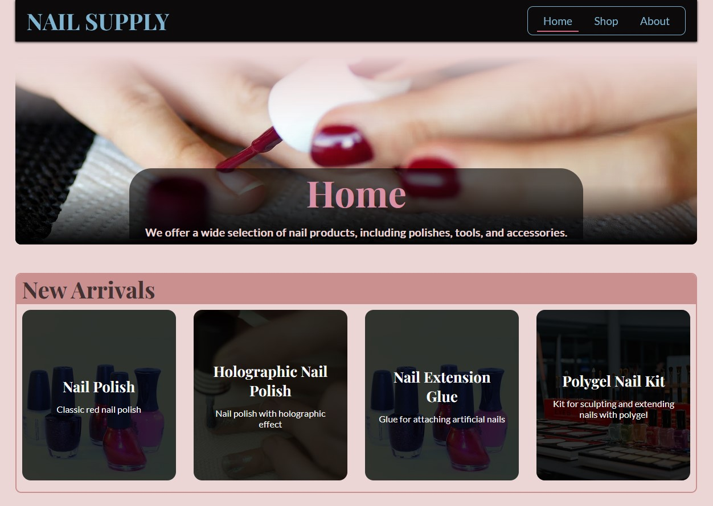

# Nail Supply Shop - First Iteration

## Overview

This project represents my first attempt at creating a fully functional web application. Prior to this attempt, my experience was confined to smaller toy projects and simple applications.

This initial iteration serves as a preliminary version of the app's appearance. I did not manage to implement all the intended features, and all data is hardcoded within the application without a database or external API integration. The primary objective was to gain a fundamental understanding of the application's structure and appearance.

## Screenshot



## Live Demo

You can check out the live demo of this iteration at [this link](https://nail-supply-shop.vercel.app/).

## Deployment Instructions

To deploy this project on your own machine, follow these steps:

1. Clone this project to your computer:
   ```
   git clone https://github.com/ledminh/nail-supply-shop
   ```

2. Install dependencies:
   ```
   npm install
   ```

3. This project uses Next.js, so the deployment steps are similar to any other Next.js app. You can run the development server with the following command:
   ```
   npm run dev
   ```

4. If you wish to deploy it to your own server, follow these steps:
   - Build the project:
     ```
     npm run build
     ```
   - Start the server:
     ```
     npm run start
     ```

## Other Iterations:

- [Nail Supply Shop v2](https://github.com/ledminh/nail-supply-shop-v2)
- [My Favorite Shop](https://github.com/ledminh/my-favorite-shop)
